# TP Node.js & Express.js - Solution Complète

Ce dépôt contient la solution complète pour le Travail Pratique (TP) sur Node.js et Express.js, couvrant les bases, le routage, les middlewares et la gestion des requêtes/réponses.

**Étudiant:** [Ragoubi Ali]
**Cours/Module:** [Node Js]

---

## Instructions pour l'exécution

1.  **Cloner le dépôt (Optionnel):**
    ```bash
    git clone https://github.com/VOTRE_NOM_UTILISATEUR/tp-expressjs-solution.git
    cd tp-expressjs-solution
    ```
2.  **Installer les dépendances:** Assurez-vous d'avoir Node.js et npm installés. Exécutez la commande suivante dans le répertoire du projet :
    ```bash
    npm install
    ```
3.  **Lancer le serveur:**
    ```bash
    node app.js
    ```
4.  Le serveur démarrera sur `http://localhost:3000` (ou le port configuré). Les logs des requêtes apparaîtront dans la console (via Morgan) et dans le fichier `app.log`.

---

## Structure du Projet


---

## Détails des Exercices et Captures d'écran

Toutes les captures d'écran se trouvent dans le dossier `/screenshot`, organisées par page et par exercice.

### Page 1: Introduction à ExpressJS

#### Exercice 1: Serveur Simple

*   **Description:** Création d'un serveur Express de base répondant sur `/` ("Hello World") et `/date` (date/heure actuelle).
*   **Captures:**
    *   
    *   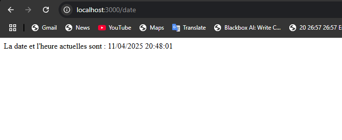

#### Exercice 2: Configuration Projet (Fichiers Statiques)

*   **Description:** Configuration pour servir des fichiers statiques depuis le dossier `/public` (index.html, style.css) et ajout d'une route `/about`.
*   **Captures:**
    *   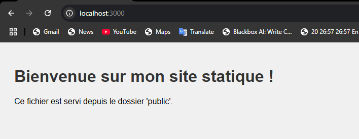
    *   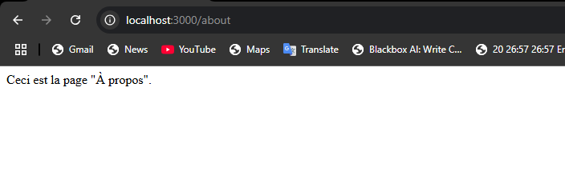

---

### Page 2: Routage avec ExpressJS

#### Exercice 1: API CRUD Tâches

*   **Description:** Implémentation d'une API RESTful simple (en mémoire) pour gérer des tâches (GET all, GET one, POST, PUT, DELETE). Utilisation de `express.json()`.
*   **Captures:**
    *   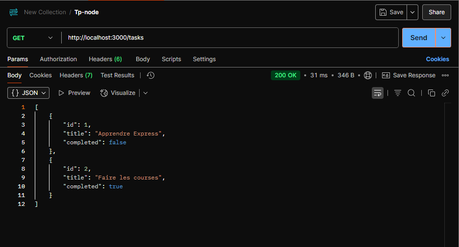
    *   
    *   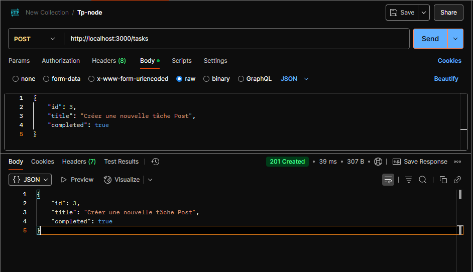
    *   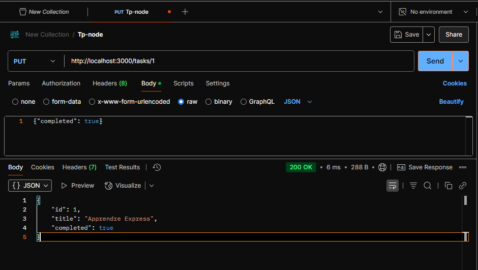
    *   

#### Exercice 2: Routes Paramétrées (Blog)

*   **Description:** Création de routes avec paramètres pour simuler une API de blog (`/posts/:year/:month?` et `/categories/:categoryName/posts`). Gestion des paramètres optionnels par routes séparées.
*   **Captures:**
    *   
    *   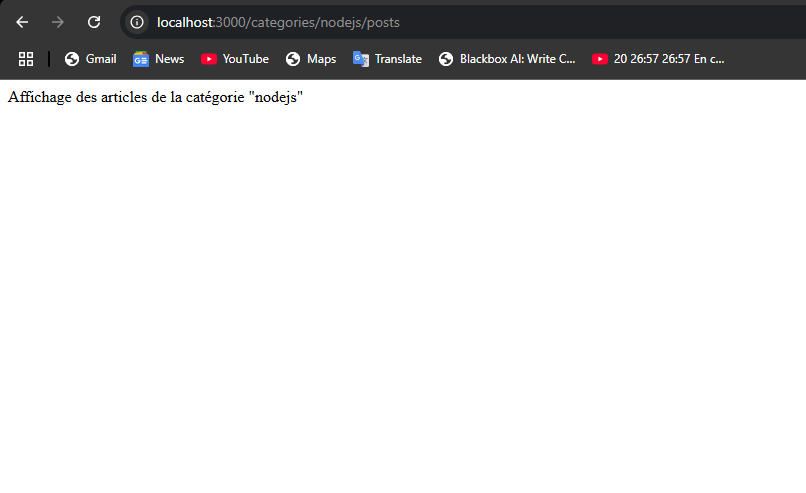

#### Exercice 3: Routeurs Modulaires

*   **Description:** Réorganisation de l'application en utilisant `express.Router()` pour séparer les logiques des tâches, posts, utilisateurs et produits dans des fichiers dédiés dans le dossier `/routes`.
*   **Captures:**
    *   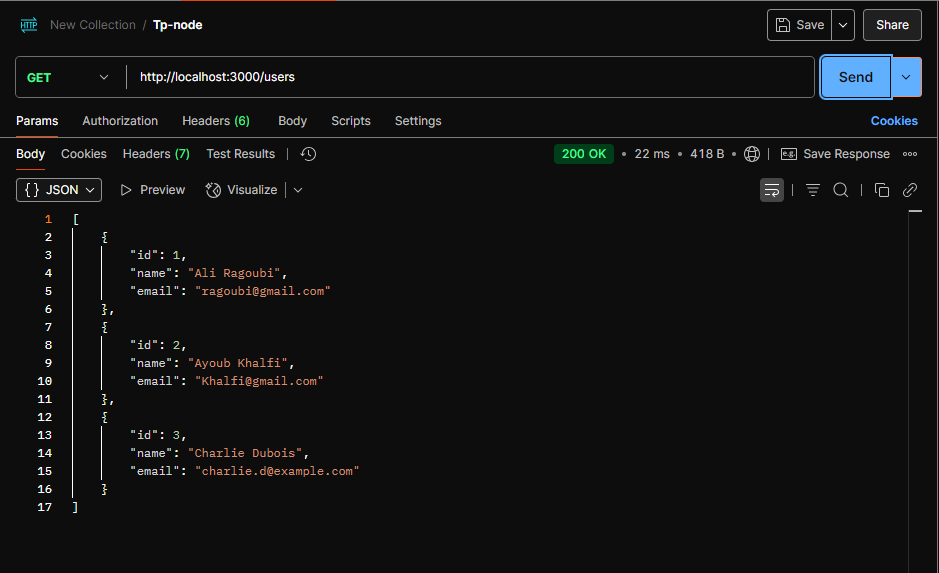
    *   
    *   *(Ajoutez ici d'autres captures si vous avez testé products ou la structure de fichier)*

---

### Page 3: Les Middlewares

#### Exercice 1: Middleware de Logging Personnalisé

*   **Description:** Création d'un middleware qui enregistre les détails de chaque requête (méthode, URL, heure, IP) dans le fichier `app.log` en utilisant le module `fs`.
*   **Capture:**
    *   

#### Exercice 2: Middleware d'Authentification Simple

*   **Description:** Implémentation d'un middleware qui vérifie la présence d'un header `Authorization` avec un token spécifique (`Bearer MON_TOKEN_SECRET`) et qui est appliqué sélectivement aux routes `/tasks`.
*   **Captures:**
    *   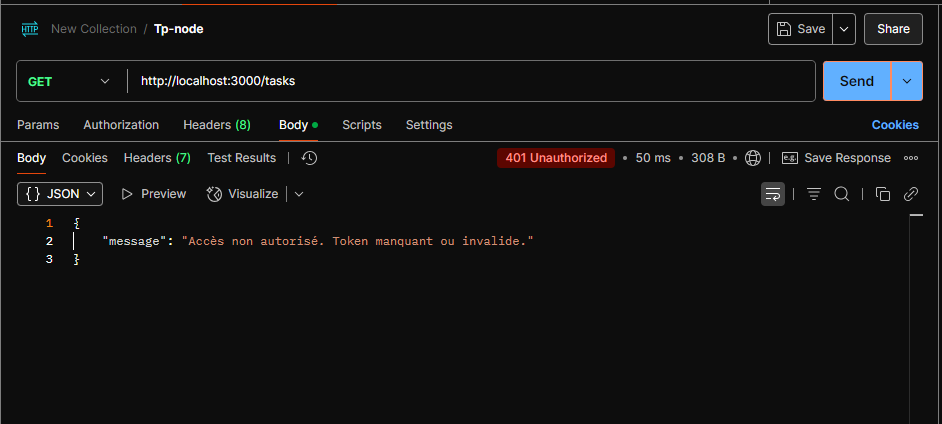
    *   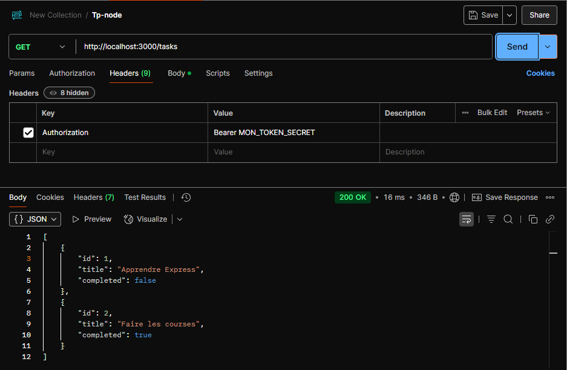

#### Exercice 3: Middlewares Tiers (morgan, cors, compression)

*   **Description:** Intégration et configuration des middlewares tiers `morgan` (logging console), `cors` (gestion cross-origin) et `compression` (compression des réponses).
*   **Captures:**
    *   
    *   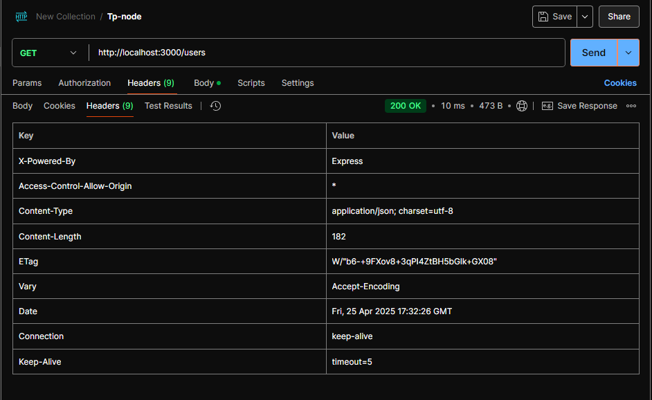

---

### Page 4: Gestion des Requêtes et Réponses

#### Exercice 1: Formulaire et Soumission

*   **Description:** Création d'un formulaire d'inscription (`public/register.html`) et d'une route `POST /register` pour traiter la soumission. Utilisation de `express.urlencoded()` pour parser les données et affichage d'une confirmation/erreur.
*   **Captures:**
    *   
    *   

#### Exercice 2: Upload de Fichiers (Multer)

*   **Description:** Mise en place d'un système d'upload d'images avec `multer`. Configuration du stockage, filtrage par type (JPEG, PNG, GIF) et limite de taille (5MB). Affichage de l'image uploadée.
*   **Captures:**
    *   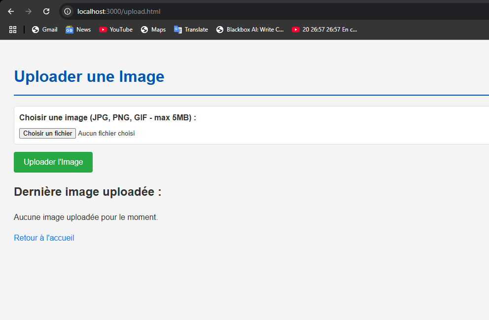
    *   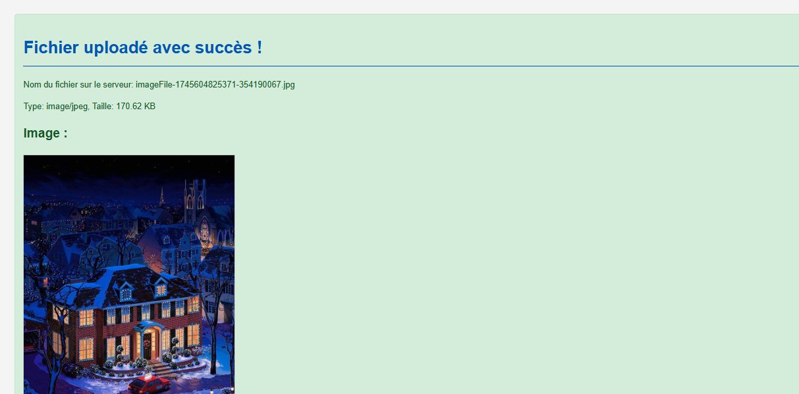
    *   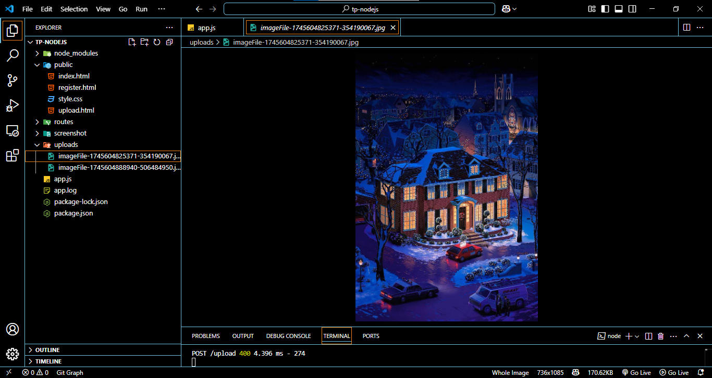
    *   *(Ajoutez la capture d'erreur si vous l'avez: `screenshot-gestion-ex2-upload-fail.png`)*

#### Exercice 3: Négociation de Contenu (res.format)

*   **Description:** Création d'une route `GET /data` qui utilise `res.format()` pour renvoyer des données en JSON, XML ou HTML en fonction de l'en-tête `Accept` envoyé par le client.
*   **Captures:**
    *   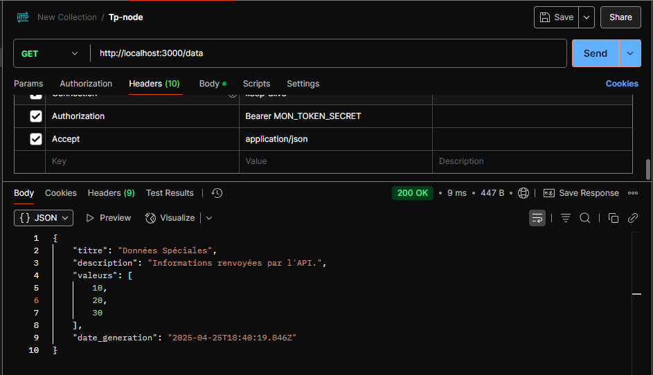
    *   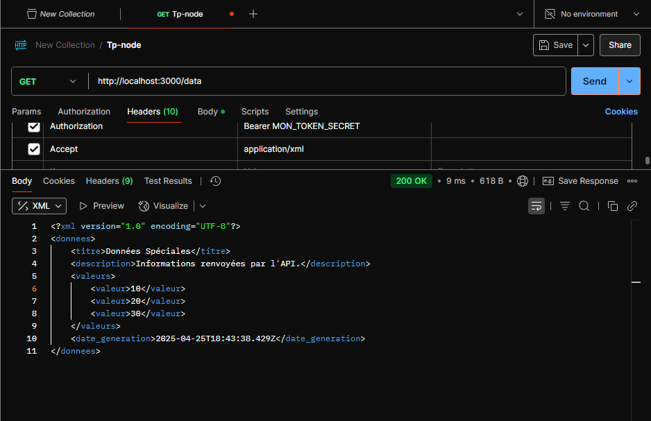
    *   
    *   *(Ajoutez la capture 406 si vous l'avez: `screenshot-gestion-ex3-not-acceptable.png`)*

---